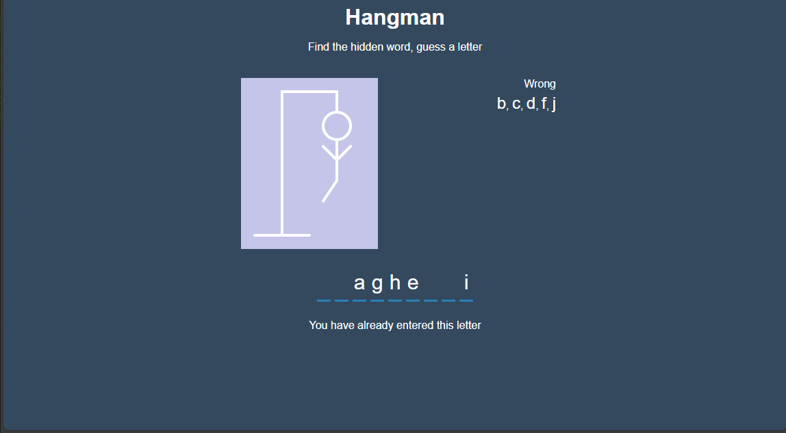
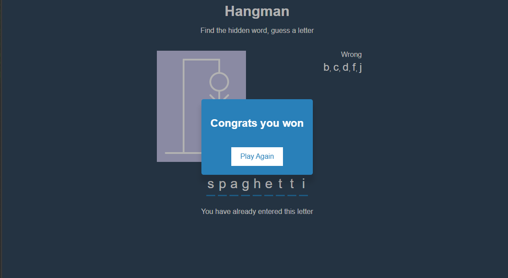
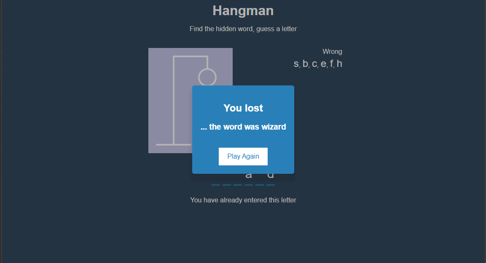

# hangman
Hangman game, made using HTML, JavaScript, CSS, and React.

Here's a match in progress,

a match being won,

and a lost match. ):

This project helped me get more familiar with using React components and useStates/useEffects. 

Want to make your own? Follow this amazing tutorial => https://www.youtube.com/watch?v=jj0W8tYX_q8&list=PLillGF-RfqbY3c2r0htQyVbDJJoBFE6Rb&index=29

